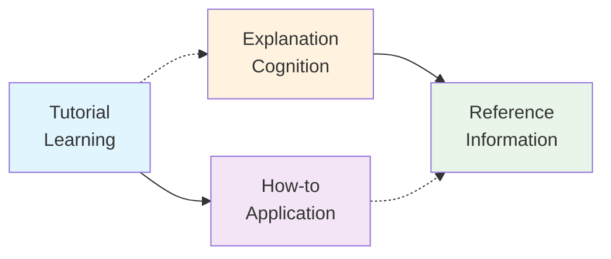

# DynamicFlow Documentation

Welcome to the DynamicFlow documentation! This documentation follows the [Diátaxis framework](https://diataxis.fr/) to provide four distinct types of documentation, each serving a specific purpose.

## 📚 Documentation Types

### 🎓 [Tutorial](./tutorial.md)
**Learning-oriented • Hands-on • Step-by-step**

A hands-on lesson that guides beginners through building their first dynamic flow system. Perfect for newcomers who want to acquire core skills through practical experience.

**Start here if you:**
- Are new to DynamicFlow
- Want to learn by building a complete example
- Prefer hands-on learning with immediate results

### 🔧 [How-to Guide](./how-to-guide.md)
**Goal-oriented • Task-focused • Problem-solving**

Focused instructions for competent users to accomplish specific tasks. These guides assume familiarity with DynamicFlow and provide practical solutions to real-world problems.

**Use this when you:**
- Know the basics but need to solve a specific problem
- Want implementation patterns for common use cases
- Need quick answers for production scenarios

### 📖 [Reference](./reference.md)
**Information-oriented • Comprehensive • Precise**

Complete API documentation with precise technical information. This is your go-to resource for exact method signatures, parameter types, and comprehensive coverage of all DynamicFlow features.

**Use this when you:**
- Need precise technical details about APIs
- Want comprehensive coverage of all features
- Are looking for specific method signatures or types

### 💡 [Explanation](./explanation.md)
**Understanding-oriented • Conceptual • Context-providing**

Conceptual explanations that provide context, rationale, and deeper understanding of DynamicFlow's design philosophy and architectural decisions.

**Read this when you:**
- Want to understand the "why" behind DynamicFlow
- Need architectural context for design decisions
- Are curious about the theoretical foundations

## 🗺️ Navigation Guide

### New to DynamicFlow?
1. Start with the **[Tutorial](./tutorial.md)** to build your first system
2. Read the **[Explanation](./explanation.md)** to understand the philosophy
3. Use the **[How-to Guide](./how-to-guide.md)** for specific implementation patterns
4. Reference the **[API Documentation](./reference.md)** as needed

### Experienced Developer?
1. Scan the **[How-to Guide](./how-to-guide.md)** for relevant patterns
2. Bookmark the **[Reference](./reference.md)** for quick API lookups
3. Check the **[Explanation](./explanation.md)** for architectural insights

### Looking for Something Specific?

#### Getting Started
- **Quick Start**: [Tutorial - Step 1](./tutorial.md#step-1-setup-and-installation)
- **First Flow**: [Tutorial - Step 2](./tutorial.md#step-2-your-first-static-flow)
- **Core Concepts**: [Explanation - Architectural Philosophy](./explanation.md#architectural-philosophy)

#### Flow Composition
- **Sequential Operations**: [How-to - Chain Operations](./how-to-guide.md#how-to-chain-operations-sequentially)
- **Parallel Execution**: [How-to - Parallel Operations](./how-to-guide.md#how-to-execute-operations-in-parallel)
- **API Reference**: [Reference - Flow Operations](./reference.md#flow-operations)

#### Tool Development
- **Creating Tools**: [Tutorial - Step 3](./tutorial.md#step-3-creating-your-first-tool)
- **Tool Patterns**: [How-to - Tool Development](./how-to-guide.md#tool-development)
- **Tool API**: [Reference - Tool System](./reference.md#tool-system)

#### Dynamic Flows
- **AI Generation**: [Tutorial - Step 5](./tutorial.md#step-5-dynamic-flow-generation-with-ai)
- **Generation Patterns**: [How-to - Dynamic Flow Generation](./how-to-guide.md#dynamic-flow-generation)
- **Why Dynamic?**: [Explanation - Runtime Graph Generation](./explanation.md#runtime-graph-generation-vs-static-workflows)

#### Human-in-the-Loop
- **Approval Workflows**: [Tutorial - Step 6](./tutorial.md#step-6-human-in-the-loop-with-persistence)
- **Persistence Setup**: [How-to - Persistence and Suspension](./how-to-guide.md#persistence-and-suspension)
- **Design Philosophy**: [Explanation - Human-in-the-Loop Design](./explanation.md#human-in-the-loop-design)

#### LLM Integration
- **Conversation Routing**: [How-to - LLM Integration](./how-to-guide.md#llm-integration)
- **LLM API**: [Reference - LLM Integration](./reference.md#llm-integration)
- **LLM Philosophy**: [Explanation - LLM Integration Philosophy](./explanation.md#llm-integration-philosophy)

#### MCP Servers
- **MCP Discovery**: [How-to - MCP Server Integration](./how-to-guide.md#mcp-server-integration)
- **MCP API**: [Reference - MCP Integration](./reference.md#mcp-integration)

#### Production Deployment
- **Deployment Patterns**: [How-to - Production Deployment](./how-to-guide.md#production-deployment)
- **Configuration**: [Reference - Configuration](./reference.md#configuration)
- **Error Handling**: [How-to - Error Handling](./how-to-guide.md#error-handling)

## 🔄 Documentation Relationship



## 🎯 Quick Reference Cards

### Essential APIs
```typescript
// Flow Composition
import { Flow } from '@jambudipa/dynamic-flow'
import { Effect, pipe } from 'effect'

const flow = pipe(
  Effect.succeed(data),
  Flow.andThen(step1),
  Flow.map(transform),
  Flow.tap(sideEffect)
)

// Tool Creation
import { Tool } from '@jambudipa/dynamic-flow'
import { Schema, Effect } from 'effect'

const tool: Tool<{ input: string }, { output: string }> = {
  id: 'my-tool',
  name: 'My Tool',
  description: 'Example tool',
  inputSchema: Schema.Struct({ input: Schema.String }),
  outputSchema: Schema.Struct({ output: Schema.String }),
  execute: (input, context) => Effect.succeed({ output: input.input })
}

// Dynamic Generation
import { DynamicFlow } from '@jambudipa/dynamic-flow'
import { OpenAi } from '@effect/ai-openai'

const result = await DynamicFlow.execute({
  prompt: "Your task description",
  tools: [tool1, tool2],
  model: OpenAi.completion({ model: 'gpt-5' })
})
```

### Common Patterns
```typescript
// Sequential execution
pipe(step1, Flow.andThen(step2), Flow.andThen(step3))

// Parallel execution  
Effect.all([task1, task2, task3], { concurrency: 'unbounded' })

// Conditional logic
Flow.andThen(data => condition ? pathA(data) : pathB(data))

// Error handling
Effect.catchAll(error => fallbackHandler(error))

// Side effects
Flow.tap(data => Effect.sync(() => console.log(data)))
```

## 📞 Getting Help

- **GitHub Issues**: [Report bugs or request features](https://github.com/jambudipa/dynamic-flow/issues)
- **GitHub Discussions**: [Ask questions and share ideas](https://github.com/jambudipa/dynamic-flow/discussions)
- **Examples**: [Working code examples](../src/examples/)

## 🤝 Contributing to Documentation

We welcome contributions to improve this documentation! Please:

1. Follow the Diátaxis framework principles
2. Ensure content aligns with the appropriate documentation type
3. Include working code examples
4. Test all code snippets before submitting

The Diátaxis framework ensures our documentation serves users effectively by:
- **Tutorials**: Teaching through hands-on learning
- **How-to Guides**: Solving specific problems
- **Reference**: Providing comprehensive technical details  
- **Explanation**: Clarifying concepts and rationale

This structure helps users find exactly what they need, when they need it.

---

**Ready to start?** Begin with the **[Tutorial](./tutorial.md)** for a hands-on introduction to DynamicFlow! 🚀
